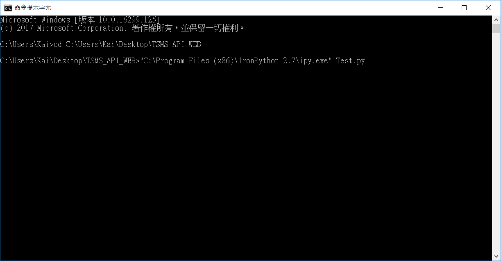
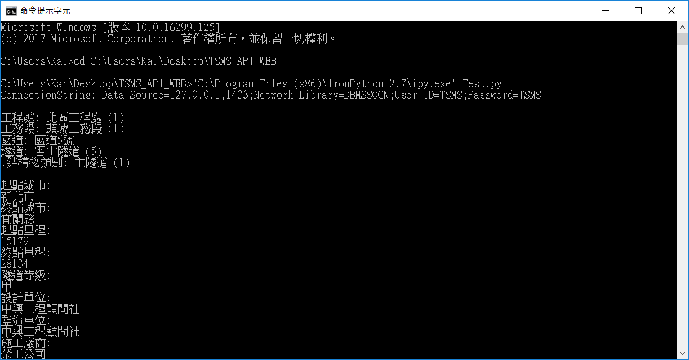
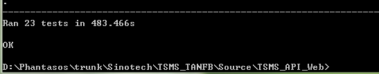
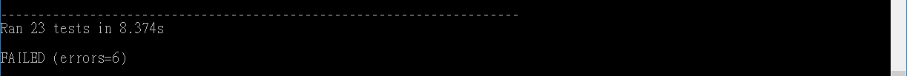
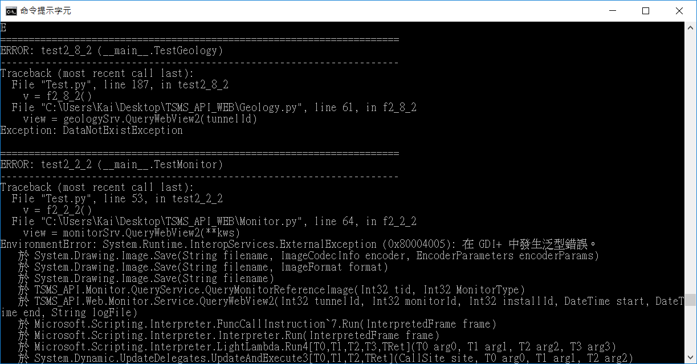

# TSMS_API_WEB 測試說明

> 此專案為測試 TSMS_API.dll 使用的測試專案
>
> 有 Bookbase.py, Geology.py 等等的模組，
> 分別對應不同的功能測試
>
> 而 Test.py 為整合以上 test cases 的總體測試，
> 因此測試時只要跑這個檔案就好了 

## 測試步驟

1. 確認資料庫連線，確認使用與資料庫資料對應的 API (TSMS_API.dll)

   在 Config.ini 中，設定 SQL SERVER 的連線位址
   
   
   
   (圖中 `127.0.0.1,1433` 處應設定為 SERVER 連線的位置，
    `User ID=TSMS;Password=TSMS` 則為進入資料庫的帳號密碼)

2. 使用 Iron Python 跑 Test.py 檔

   請先下載 Iron Python 並安裝完成，
   [點我前往 Iron Python 官網](http://ironpython.net/)
   
   請使用 Iron Python 裡的 ipy.exe，執行 Test.py
   
   以 Windows 系統為例，開啟 cmd，請先到 Test.py 的資料夾下，並使用以下指令
   
   
   
   (圖中第一項指令為往 ipy.exe 的路徑，第二格參數放 Test.py)
   
   執行成功的話，就會開始跑測試程式
   
   
      
3. 確認結果

   全數通過測試，應顯示
   
   
   
   而假使有錯誤的話會顯示
   
   
   
   而往上就能看到是哪些方法(函式)出錯
   
   
   
   (舉例來說，這張圖顯示了 test2_8_2 和 test2_2_2 出錯，
   
   而第一個產生的例外為 `Exception: DataNotExistException`)

